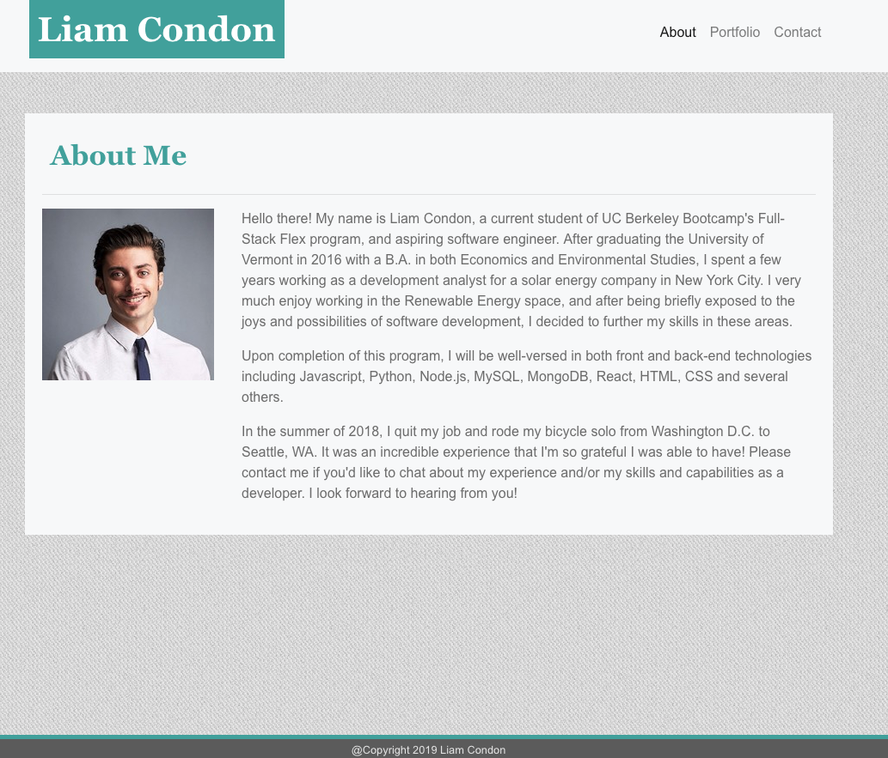

# Liam Condon - A Bootstrap Portfolio

### Live Link

https://ltcondon.github.io/Bootstrap-Portfolio/

## Synopsis

This portfolio is one built using Bootstrap, composed of html and minimal css. Bootstrap's grid structure and responsive breakpoints minimized the need for media queries, so very few were added using css.

## Layout

The Portfolio is laid out across three pages, 'About' (also the home page or 'index'), 'Portfolio', and 'Contact'. Each page has it's own distinct .html page, but all three refer to Bootstrap's CDN and to one CSS sheet. 

Each page contains a navigation bar with a header (my name) and a footer (basic copyright info).

## Content

The 'About' page contains basic education and personal information about myself and my experience, as well as a professional headshot.

The 'Portfolio' page contains six placeholder images for projects that are to be built.

The 'Contact' page contains a three-field form by which a viewer may contact me by providing a Name, Email, and a Subject (message).

